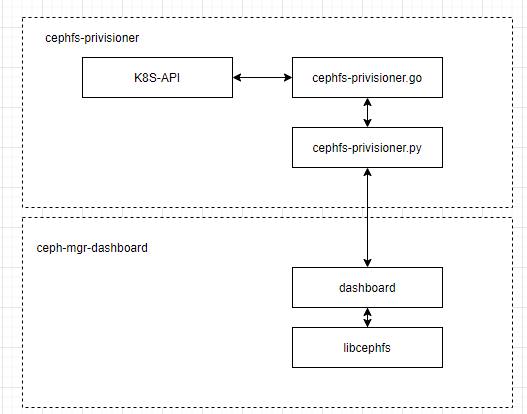
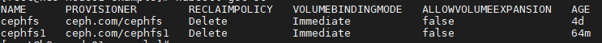
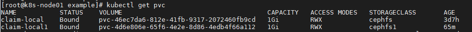
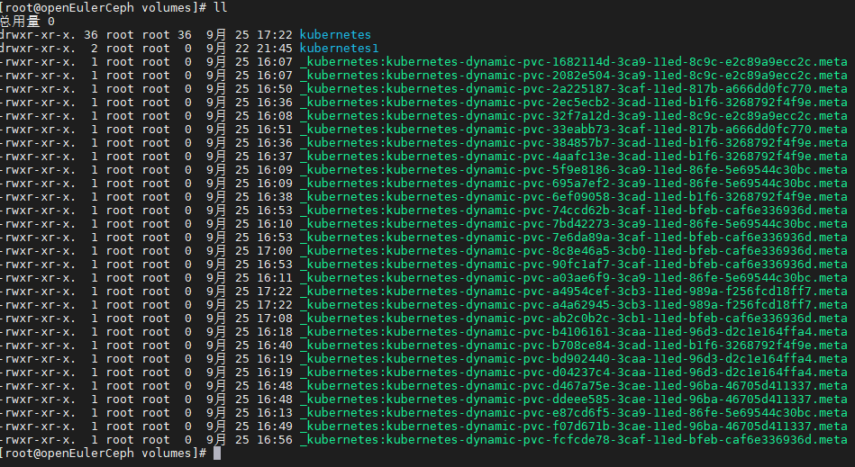

# README

## 背景

本项目cephfs引自项目：https://github.com/kubernetes-retired/external-storage， 主要是k8s通过storageclass调用本项目，来使用cephfs作为k8s的后端存储

## 流程

## 使用方法

+ .以容器的方法使用

1.构建容器

~~~bash
cd cephfs
docker build -t storage/cephfs-provisioner:v4.0 .
~~~

2.启动服务

~~~bash
vim deploy/rbac/deployment.yaml 修改版本号
image: "cephfs-provisioner-storage:v4.0"
kubectl apply -f deploy/rbac/*.yaml
~~~

3.使用

~~~bash
kubectl apply -f example/*.yaml
~~~

4.查看sc, pvc的情况

sc情况：

pvc情况：

​	

再到ceph通过内核挂载方式查看：

+ 以rpm包的方式， 因为k8s可以编排容器，所以推荐使用容器方式，暂不推荐使用rpm方式

~~~bash
chmod +x make_rpm.sh
./make_rpm.sh
~~~

参考文章：https://blog.51cto.com/leejia/2583381